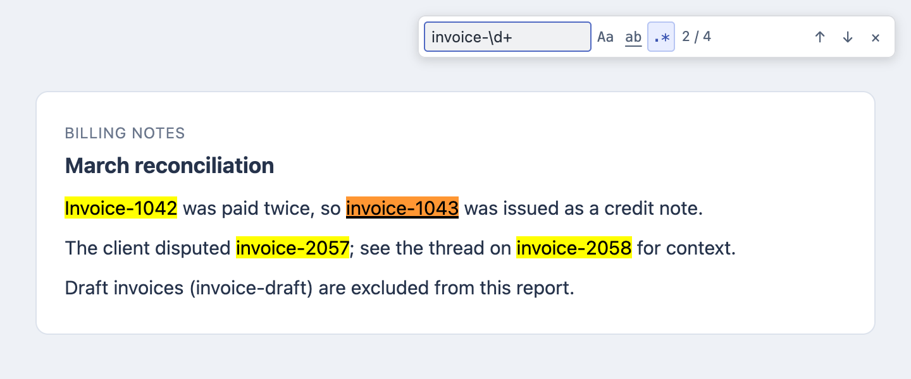

# Better Chrome Find


A Chrome extension that replaces the built-in Find bar (Cmd/Ctrl+F) with a VS Code-style search: case-sensitive, whole-word and regex toggles that work in any combination. One search per tab.

<picture>
  <source media="(prefers-color-scheme: dark)" srcset="docs/screenshot-dark.png">
  
</picture>

## Install

The extension isn't on the Chrome Web Store, so you build it and load it unpacked:

1. Run `npm ci && npm run build`.
2. Open `chrome://extensions`, enable **Developer mode**, click **Load unpacked** and select the `dist` folder.
3. Refresh open pages. After later builds, click **Reload** on the extension card.

## Use

| Shortcut | Action |
| --- | --- |
| Cmd+F / Ctrl+F | Open or focus the bar and select the query |
| Enter / Shift+Enter | Next / previous match |
| Escape | Close the bar and clear highlights |
| Cmd+Shift+F / Ctrl+Shift+F | Fallback shortcut (set at `chrome://extensions/shortcuts`) |

**Aa**, **ab** and **.\*** toggle case, whole-word and regex matching. The toolbar icon lets you disable the extension everywhere or just for the current site; disabled pages use Chrome's native Find. Queries last for the tab's browser session.

## Limits

- Searches rendered text in the page, permitted iframes and open shadow roots. Hidden content, form fields, closed shadow roots, canvas, PDFs and Chrome internal pages are skipped.
- Regex runs in Unicode multiline mode without `/` delimiters, with a 500 ms budget per frame.
- Keeps at most 10,000 matches per tab; a `+` after the count means there are more.

## Privacy

Everything runs locally, with no network requests. Page text is never stored. Queries live in `chrome.storage.session` and enablement settings in `chrome.storage.local`.

## Development

Requires Node.js 20.19+ or 22.12+.

```sh
npm run build          # type-check and bundle into dist/
npm test               # unit tests (vitest)
npx playwright install chromium
npm run test:browser   # extension tests in Playwright
npm run test:chrome    # smoke test against installed Chrome
npm run screenshots    # regenerate the README screenshots in docs/
```

Source is TypeScript under `src/`. The panel lives in a Shadow DOM, and matches are painted with CSS Custom Highlights. Regex matching runs in terminable workers in an offscreen document, so a slow pattern can't freeze the page.

If the default npm registry fails on this machine, install with `npm ci --registry https://registry.npmjs.com --userconfig /dev/null`.
